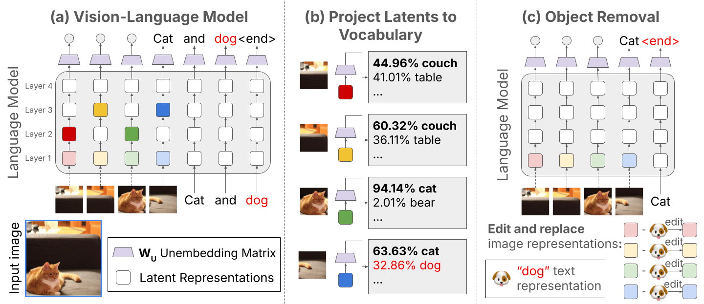

# Interpreting and Editing the Internal Representations of Vision-language Models
Official PyTorch Implementation

### [Paper](https://arxiv.org/) | [Project Page]()




## Code structure

Main files:
```
src/
  main.py           # Entry point for running captioning models
  utils/
    options.py      # Lists argparse options for main.py
  caption/
    __init__.py     # Imports available captioning models
    base_engine.py  # Base class for captioning models
    instruct_blip_engine.py  # InstructBLIP captioning models; extends from base.py
    lavis/       # Source code for Instruct-BLIP models; note that instruct-blip-{7b,13b} use lavis/models/blip2_models/blip2_vicuna_instruct.py)
    llava/       # Source code for LLaVA models
```

The configs for InstructBLIP models are under `src/caption/lavis/configs/`. All model checkpoints can be found under `/shared/spetryk/large_model_checkpoints`.


## Setup

### Models
To install InstructBLIP, please enter the lavis repo for model-specific instructions.

### Files
```
git clone git@github.com:nickjiang2378/vl-interp.git
cd vl-interp
```

Symlink my `data` folder under the top-level of your repo, i.e., under `vl-hallucination/`:
```
ln -s /home/spetryk/language-prior/data .
```

### Environment

Package installation is a bit fragmented at the moment. After creating a new environemtn, you first clone the LLaVA repo, install those required packages, then install this repo, and then there's a couple packages to manually install that haven't been incorporated into the requirements yet.
```
# Create a new conda environment
conda create -n vl python=3.9
conda activate vl

# Set up LLaVA repo
mkdir src/caption/llava
cd src/caption/llava
git clone https://github.com/haotian-liu/LLaVA.git
cd LLaVA
git checkout 414cebd318daf563e624ac5d5e02835d40573cb2
pip3 install -e .

# cd back into repo root
cd ../../../../
pip3 install -e .

# Install some remaining packages
pip3 install lightning openai-clip transformers==4.37.2
```

